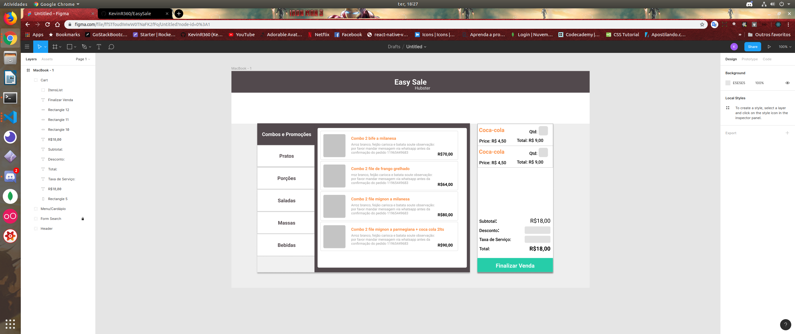
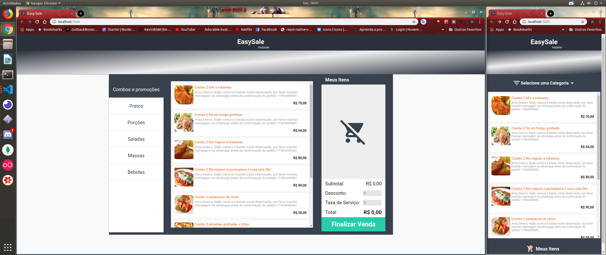

# EasySale

Simples layout de vendas de um restaurante.

Fique bem orgulhoso do resultado.

Para executar basta usar o comando abaixo na raiz da pasta web.

```
  yarn start
```

# Esboço inicial do projeto feito no Figma:



# Resultado final - porque acabou o tempo kkkkk:



# Tecnologias usadas:

- [x] ReactJS;
- [x] Redux;
- [x] Redux Saga;
- [x] Styled Components;
- [x] React Hooks;
- [x] Axios;
- [x] React Icons;
- [x] ESlint e Prettier (para padrão de código);
- [x] Reactotron (para testes com Redux);
- [x] Toastfy;
